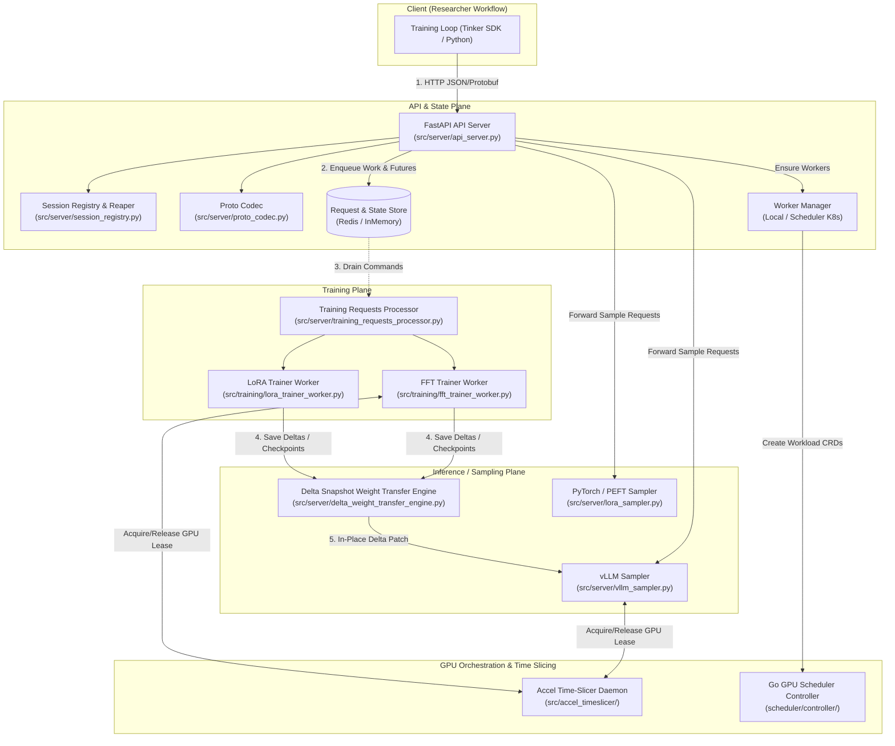
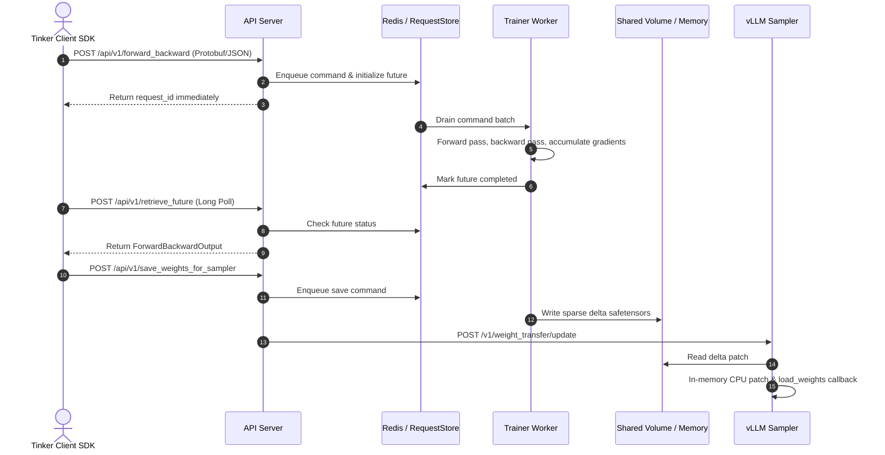

# OpenRL Architecture

OpenRL exposes the Tinker API via FastAPI, queues training work across models, delegates execution to dedicated or shared GPU workers, and synchronizes updated weights to sampling engines with minimal overhead.

## Key Abstractions

| Abstraction | File Location | Responsibility |
|---|---|---|
| `api_server.py` | `src/server/api_server.py` | FastAPI application exposing Tinker API (`/api/v1/create_model`, `/api/v1/forward_backward`, `/api/v1/optim_step`, `/api/v1/sample`, `/api/v1/retrieve_future`). Manages async future polling and session heartbeats. |
| `proto_codec.py` | `src/server/proto_codec.py` | Zero-copy byte manipulation converting Protobuf wire formats (used by Tinker SDK >= 0.25) to internal command structures without requiring NumPy in API edge pods. |
| `RequestStore` / `StateStore` | `src/server/store.py` | Queue abstraction for per-model command streams and futures. Backed by `InMemoryStore` (local dev) or `RedisStore` (cluster/multi-process). |
| `WorkerManager` | `src/server/worker_manager.py` | Factory protocol for spinning up model runtimes. `LocalWorkerManager` spawns subprocesses; `SchedulerWorkerManager` creates Kubernetes `Workload` CRDs. |
| `TrainingRequestsProcessor` | `src/server/training_requests_processor.py` | Background daemon polling `RequestStore` for batched tenant training commands and executing them against worker backends. |
| `LoraTrainingWorker` / `FFTTrainingWorker` | `src/training/` | Underlying PyTorch execution engines. LoRA worker maintains multi-tenant adapters over a frozen base model; FFT worker runs full-weight backpropagation and optimizer steps. |
| `DeltaSnapshotWeightTransferEngine` | `src/server/delta_weight_transfer_engine.py` | Pull-based delta weight sync for vLLM. Applies sparse safetensors patches into CPU snapshot memory and loads updated tensors directly into GPU memory without process restarts. |
| `SingleNodeTimeSlicer` | `src/accel_timeslicer/` | IPC socket/TCP daemon managing GPU residency leases between training and sampling workloads on shared accelerators via `llm-d` or `cuda-checkpoint`. |
| `Workload Controller` | `scheduler/controller/` | Go controller reconciling `openrl.io/v1alpha1` `Workload` and `ClaimLedger` resources against Kubernetes Dynamic Resource Allocation (DRA) `ResourceSlice` objects. |
| `estimator.py` | `src/server/estimator.py` | Memory footprint calculation for base models, LoRA ranks, optimizer states, and context lengths used to size worker device allocations. |

## Data & Request Lifecycle

